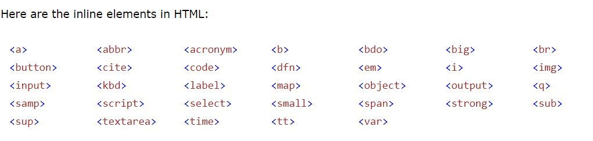
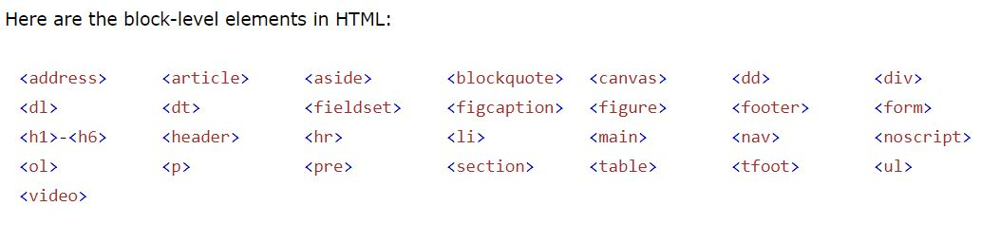

# HTML W3Schools

notes :

- A browser does not display the HTML tags, but uses them to determine how to display the document:

- The HTML element is everything from the start tag to the end tag

- You should always include the `lang` attribute inside the `<html>` tag, to declare the language of the Web page. This is meant to assist search engines and browsers.

- The `title` attribute defines some extra information about an element. it appers like tooltip

- **_recommended_** lowercase attributes in HTML, and **_demands_** lowercase attributes for stricter document types like XHTML.

- Search engines use the headings to index the structure and content of your web pages.

- `<pre>` tag preserves both spaces and line breaks

- `<b>` - Bold , `<strong>` - Important , `<i> `- Italic , `<em> `- Emphasized , `<mark>` - Marked ,`<small>` - Smaller , `<del>` - Deleted , `<ins>` - Inserted , `<sub>` - Subscript , `<sup>` - Superscript

- `<abbr>` tag defines an abbreviation or an acronym

- The HTML `<bdo`> tag is used to override the current text direction `dir="rtl"`

- The `target` attribute define where to open the linked document , it can have one of the following values:

  - `_self `- Default. Opens the document in the same window/tab as it was clicked
  - `_blank `- Opens the document in a new window or tab
  - `_parent` - Opens the document in the parent frame
  - `_top` - Opens the document in the full body of the window

- ` <map>` tag defines an image map. An image map is an image with clickable areas. The areas are defined with one or more `<area>` tags.

example

```
    
    <map name="workmap">
    <area shape="rect" coords="34,44,270,350" alt="Computer" href="computer.htm">
    </map>

```

`Shape` can be rect - circle - poly - default

- `<picture>` element allows you to display different pictures for different devices or screen sizes.

  - it contains one or more `<source>` elements, each referring to different images , This way the browser can choose the image that best fits the current view and/or device.

  - Each` <source>` element has a media attribute that defines when the image is the most suitable.

- HTML tables can have cells that spans over multiple rows and/or columns `colspan` `rowspan`
  
- `list-style-type` define the style of the list item marker. 

- A description list is a list of terms, with a description of each term.

- A block level element has a top and a bottom margin, whereas an inline element does not.





