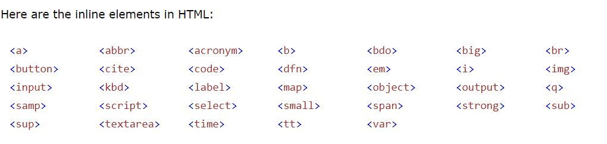
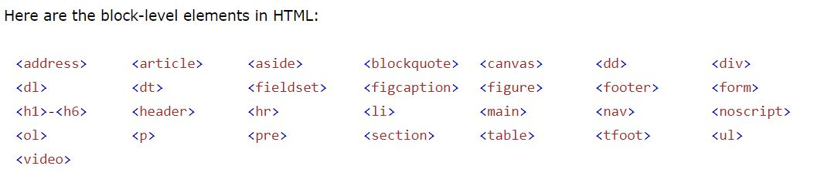
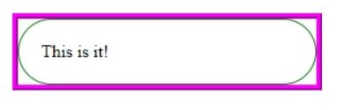
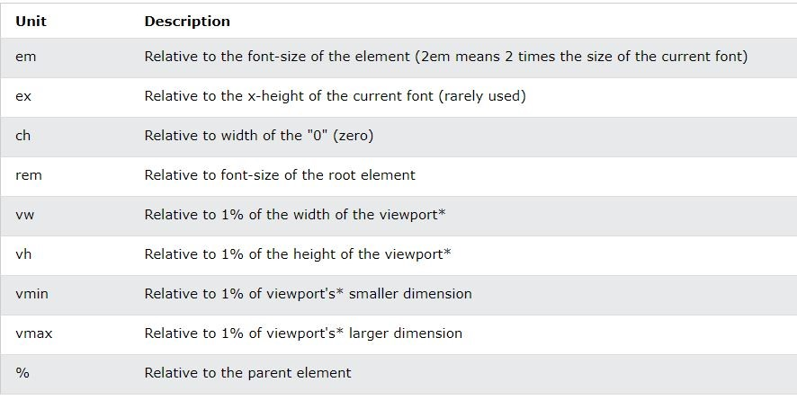

# HTML W3Schools

notes :

- A browser does not display the HTML tags, but uses them to determine how to display the document:

- The HTML element is everything from the start tag to the end tag

- You should always include the `lang` attribute inside the `<html>` tag, to declare the language of the Web page. This is meant to assist search engines and browsers.

- The `title` attribute defines some extra information about an element. it appers like tooltip

- **_recommended_** lowercase attributes in HTML, and **_demands_** lowercase attributes for stricter document types like XHTML.

- Search engines use the headings to index the structure and content of your web pages.

- `<pre>` tag preserves both spaces and line breaks

- `<b>` - Bold , `<strong>` - Important , `<i>`- Italic , `<em>`- Emphasized , `<mark>` - Marked ,`<small>` - Smaller , `<del>` - Deleted , `<ins>` - Inserted , `<sub>` - Subscript , `<sup>` - Superscript

- `<abbr>` tag defines an abbreviation or an acronym

- The HTML `<bdo`> tag is used to override the current text direction `dir="rtl"`

- The `target` attribute define where to open the linked document , it can have one of the following values:

  - `_self`- Default. Opens the document in the same window/tab as it was clicked
  - `_blank`- Opens the document in a new window or tab
  - `_parent` - Opens the document in the parent frame
  - `_top` - Opens the document in the full body of the window

- `<map>` tag defines an image map. An image map is an image with clickable areas. The areas are defined with one or more `<area>` tags.

example

```


<map name="workmap">
<area shape="rect" coords="34,44,270,350" alt="Computer" href="computer.htm">
</map>

```

`Shape` can be rect - circle - poly - default

- `<picture>` element allows you to display different pictures for different devices or screen sizes.

  - it contains one or more `<source>` elements, each referring to different images , This way the browser can choose the image that best fits the current view and/or device.

  - Each`<source>` element has a media attribute that defines when the image is the most suitable.

- HTML tables can have cells that spans over multiple rows and/or columns `colspan` `rowspan`
- `list-style-type` define the style of the list item marker.

- A **_description list_** is a list of terms, with a description of each term.




- The HTML `<iframe>` tag specifies an inline frame (to embed another document within the current HTML document)

---

- HTML metadata `<meta>` is data about the HTML document, is not displayed, Metadata typically define the document title, character set, styles, scripts, and other meta information. it is used by browsers , by search engines (keywords), and other web services.

Examples

```
<meta charset="UTF-8">
<meta name="description" content="Free Web tutorials">
<meta name="keywords" content="HTML, CSS, JavaScript">
<meta name="author" content="John Doe">
<meta name="viewport" content="width=device-width, initial-scale=1.0">

```

`width=device-width` sets the width of the page to follow the screen-width of the device

`initial-scale=1.0` sets the initial zoom level when the page is first loaded by the browser.

---

- The `<base>` element specifies the base URL and/or target for all relative URLs in a page. must have an `href` or a `target` attribute present, or both.

---

- Floating elements are tied to the document flow, which may harm the flexibility.

the next group effects the apperents

- `<kbd>` element defines keyboard input
- `<samp>` element defines sample output from a computer program
- `<code>` element defines a piece of computer code
- `<var>` element defines a variable in programming or in a mathematical expression
- `<pre>` element defines preformatted text

---

- A semantic element clearly describes its meaning to both the browser and the developer. ( `<article>` `<aside>` `<details>` `<footer>` `<header>` `<nav>` `<section>` `<summary>` `<time>` ...)

- The `<figure>` tag specifies self-contained content, like illustrations, diagrams, photos, code listings, etc.

- The `<figcaption>` tag defines a caption for a <`figure>` element.

- Character entities are used to display reserved characters in HTML. (`&nbsp;` , `&lt;` .... ) you can either use the name or the number , emoji also have numbers that we can use

- To display an HTML page correctly, a web browser must know the character set used in the page. This is specified in the `<meta>`tag `<meta charset="UTF-8">` ( ASCII , ANSI , ISO-8859-1 , UTF-8 )

---

- `URL` Uniform Resource Locators

`scheme://prefix.domain:port/path/filename`

- **_scheme_** - defines the type of Internet service (http or https , ftp(Downloading or uploading files))
- **_prefix_** - defines a domain prefix (default for http is www)
- **_domain_** - defines the Internet domain name
- **_port_** - defines the port number at the host (default for http is 80)
- **_path_** - defines a path at the server (If omitted: the root directory of the site)
- **_filename_** - defines the name of a document or resource

---

### XHTML

- stands for EXtensible HyperText Markup Language
- is a stricter, more XML-based version of HTML
- is HTML defined as an XML application
- is supported by all major browsers

XML is a markup language where all documents must be marked up correctly (be "well-formed")

XHTML was developed to make HTML more **_extensible_** and **_flexible_** to work with other data formats (such as XML). In addition, **_browsers ignore errors in HTML_** pages, and try to display the website even if it has some errors in the markup. So **_XHTML comes with a much stricter error handling_**.

examples

- `<!DOCTYPE>` is mandatory
- The xmlns(namespace for a document) attribute in `<html>` is mandatory
- `<html>`, `<head>`, `<title>`, and `<body>` are mandatory
- Elements must always be properly nested , closed , in lowercase
- Attribute names must always be in lowercase , quoted , minimization is forbidden

---

- `<datalist>` Specifies a list of pre-defined options for input controls

- `<output>` Defines the result of a calculation

- The input `pattern` attribute specifies a regular expression that the input field's value is checked against,

- The input `multiple` attribute specifies that the user is allowed to enter more than one value in an input field.

- The `input` size attribute specifies the visible width, in characters, of an input field.

- The input `autofocus` attribute specifies that an input field should automatically get focus when the page loads.

- The input `formaction` attribute specifies the URL of the file that will process the input when the form is submitted.
- The input `formmethod` attribute defines the HTTP method for sending form-data to the action URL.

---

- The HTML `<canvas>` element is used to draw graphics on a web page.

- The HTML `<svg>` element is a container for SVG graphics.

- SVG stands for Scalable Vector Graphics
- SVG is used to define graphics for the Web

SVG is a language for describing 2D graphics in XML. SVG is XML based, which means that every element is available within the SVG DOM. You can attach JavaScript event handlers for an element.

Canvas draws 2D graphics, on the fly (with a JavaScript).

---

APIs

- The HTML Geolocation API is used to get the geographical position of a user.the position is not available unless the user approves it.

- The `getCurrentPosition()` method is used to return the user's position.

- With web storage (sessionStorage , localStorage ), web applications can store data locally within the user's browser.

- Unlike cookies, the storage limit is far larger (at least 5MB) and information is never transferred to the server.

- Web storage is per origin (per domain and protocol). All pages, from one origin, can store and access the same data.

- Server-Sent Events (SSE) allow a web page to get updates automatically from a server - One Way Messaging

---

## CSS W3schools

All the styles in a page will "cascade" into a new "virtual" style sheet by the following rules, where number one has the highest priority:

1. Inline style (inside an HTML element)
2. External and internal style sheets
3. Browser default

background properties :

- `background-color`
- `background-image`
- `background-repeat`
- `background-attachment` ( scroll or fixed )
- `background-position`
- `background`(shorthand property) (example : `background: #ffffff url("img_tree.png") no-repeat right top;`) , It does not matter if one of the property values is missing, as long as the other ones are in this order.

- If `border-color` is not set, it inherits the color of the element.
- Top and bottom margins of elements are sometimes collapsed into a single margin that is equal to the largest of the two margins.

- the `box-sizing : border-box;` property causes the element to maintain its actual width; if you increase the padding, the available content space will decrease. other oprtions (content-box, Global values ( inherit, initial, revert ,unset))

- An `outline` is a line that is drawn around elements, OUTSIDE the borders, to make the element "stand out" , the other outline properties will not have ANY effect unless the `outline-style` property is set , **_doesn't take up space_** , it supports offset

the diffrence between outline and border



- `direction` and `unicode-bidi` properties can be used to change the text direction of an element:

- `text-transform` is used to specify uppercase and lowercase letters in a text (uppercase , lowercase , capitalize ).

- `text-indent` is used to specify the indentation of the first line of a text

- `line-height` is used to specify the space between lines

- `word-spacing` is used to specify the space between the words

- `white-space` specifies how white-space inside an element is handled.

In CSS there are five generic font families:

- **_Serif_** fonts have a small stroke at the edges of each letter. sense of formality and elegance.
- **_Sans-serif_** fonts have clean lines (no small strokes attached). modern and minimalistic look.
- **_Monospace_** fonts - here all the letters have the same fixed width. mechanical look.
- **_Cursive_** fonts imitate human handwriting.
- **_Fantasy_** fonts are decorative/playful fonts.

- The **_font-family_** property should hold several font names as a "fallback" system, to ensure maximum compatibility between browsers/operating systems.

- `1em` is equal to the current font size. The default text size in browsers is `16px`. So, the default size of 1em is 16px. some browsers have a problem with the em sizes so the solution is to default font-size in percent for the `<body>` element `body {font-size: 100%;}`

- A font `superfamily` is a set of fonts designed to work well together. So, using different fonts within the same superfamily is safe.

- Font Pairing Rules (Complement, Use Font Superfamilies , Contrast is King , Choose Only One Boss )

- `font` property is a shorthand property for(`font-style`,`font-variant`, `font-weight`, `font-size/line-height`,`font-family`) , `font-size` and `font-family` values are required

- The four links states are:

  - `a:link`- a normal, unvisited link
  - `a:visited`- a link the user has visited
  - `a:hover` - a link when the user mouses over it
  - `a:active` - a link the moment it is clicked

- we can change the curser type using `cursor` property

- `list-style-image` property specifies an image as the list item marker

- `list-style-type` property specifies the type of list item marker.

- There are five different `position` values (static ,relative , fixed, absolute ,sticky )

- elements are positioned `static` by default.

- `display: inline-block` allows to set a width and height on the element , the top and bottom margins/paddings are respected , not like the inline

- Center

```
 .perant {
  height: 200px;
  position: relative;
}

.child {
  margin: 0;
  position: absolute;
  top: 50%;
  left: 50%;
  transform: translate(-50%, -50%);
}
```

```.center {
  display: flex;
  justify-content: center;
  align-items: center;
  height: 200px;
}
```

- A `pseudo-class` is used to define a special state of an element. ( link , visited , hover , active) also ( first-child , lang )

- A CSS `pseudo-element` is used to style specified parts of an element. (:first-line ,:first-letter , :before , :after , :marker ,:selection )

- The `::selection`pseudo-element matches the portion of an element that is selected by a user.

- The `[attribute]` selector is used to select elements with a specified attribute.

- CSS `counters` are "variables" maintained by CSS whose values can be incremented by CSS rules

- **_Relative length_** units specify a length relative to another length property. The em and rem units are practical in creating perfectly scalable layout!



- If there are two or more conflicting CSS rules that point to the same element, the browser follows some rules to determine which one is most specific and therefore wins out.
- **_specificity_** as a score/rank that determines which style declarations are ultimately applied to an element.

There are four categories which define the specificity level of a selector:

1. **_Inline styles_**

2. **_IDs_**

3. **_Classes_**, **_attributes_** and **_pseudo-classes_**

4. **_ Elements_** and **_pseudo-elements_**

5. The universal selector and inherited values (specificity of 0)

- The CSS `math` functions allow mathematical expressions to be used as property values ( calc(), max() : Uses the largest value , min() : Uses the smallest value).

- CSS defines three types of gradients:

  - Linear Gradients (goes down/up/left/right/diagonally)
  - Radial Gradients (defined by their center)
  - Conic Gradients (rotated around a center point)

- `writing-mode` specifies whether lines of text are laid out horizontally or vertically.

- `word-break` specifies line breaking rules.

- `box-reflect` is used to create an image reflection.

- `column-count` specifies the number of columns an element should be divided into.

---

- The`var()` function is used to insert the value of a CSS variable.

  To create a variable with global scope, declare it inside the :root selector. The :root selector matches the document's root element.

```
:root {
  --blue: #1e90ff;
  --white: #ffffff;
}
```

To create a variable with local scope, declare it inside the selector that is going to use it.

```
body { background-color: var(--blue); }
```

---

- The CSS`box-sizing` Defines how the width and height of an element are calculated: should they include padding and borders, or not

---

Media queries can be used to check many things, such as:

- width and height of the viewport
- width and height of the device
- orientation (is the tablet/phone in landscape or portrait mode?)
- resolution

- The `flex-flow` property is a shorthand property for setting both the flex-direction and flex-wrap properties.

- The `align-items` property is used to align the **_flex items_** .

- The `align-content` property is used to align the **_flex lines_**.

---

The viewport is the user's visible area of a web page.  varies with the device

`<meta name="viewport" content="width=device-width, initial-scale=1.0">`

---

- CSS Grid Layout Module offers a grid-based layout system, with rows and columns, making it easier to design web pages without having to use floats and positioning.

- An HTML element becomes a grid container when its display property is set to grid or inline-grid.

- `grid-template-columns` property defines the number of columns in your grid layout and it can define the width of each column.

- `grid-gap` property is a shorthand property for the `grid-row-gap` and the `grid-column-gap` properties , sets the gap between the columns and sets the gap between the rows

- `justify-content` is used to align the whole grid inside the container.

- `align-content` is used to vertically align the whole grid inside the container.

- `grid-column` defines on which column(s) to place an item. shorthand property for the `grid-column-start` and the `grid-column-end` properties. same for raw

- `grid-area` can be used as a shorthand for the `grid-row-start`, `grid-column-start`, `grid-row-end` and the `grid-column-end` properties.

---

CSS Sprites

CSS `Sprites` are a means of combining multiple images into a single image file for use on a website, to help with performance. (get the image once, and shift it around and only display parts of it. This reduces the overhead of having to fetch multiple images)

---
