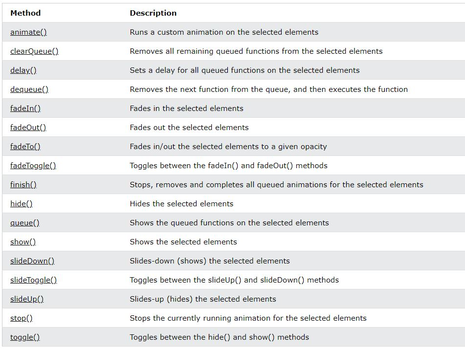

# JQuery

jQuery is a lightweight, "write less, do more", JavaScript library , The purpose of jQuery is to make it much easier to use JavaScript on your website (simplifies a lot of the complicated things from JavaScript, like AJAX calls and DOM manipulation).

features:

- HTML/DOM manipulation
- CSS manipulation
- HTML event methods
- Effects and animations
- AJAX
- Utilities
- plugins for almost any task out there.

---

`$(selector).action()`

---

```
$(document).ready(function(){

// code

});
```

can be written like this

```
$(function(){

  // code

});
```

---

## **_Events_**

`click()` , `dblclick()` , `mouseenter()` , `mouseleave()` , `mousedown()` , `mouseup()` , `hover()` , `focus()` , `blur()` , (when the form field loses focus) `on()` ,


---

## **_Effects _**

`Hide`, `Show`, `Toggle`, `Slide`, `Fade`, and `Animate`.

1. can take optional speed parameter `slow`, `fast`, or milliseconds

2. optional callback parameter

- `fadeTo` ( required opacity parameter , allows fading to a given opacity (value between 0 and 1))

- `animate`

  - `$(selector).animate({params},speed,callback);`

  - params is like css rules , we can use Relative Values ( `'+=150px'` .... ) , also we can "show", "hide", or "toggle" example `height: 'toggle'`

  - jQuery comes with queue functionality for animations.

  - if you write multiple animate() calls after each other, jQuery comes with queue functionality for animations.

- `stop()` method is used to stop animations or effects before it is finished. it works for all jQuery effect functions, including sliding, fading and custom animations.

JavaScript statements are executed line by line. However, with effects, the next line of code can be run even though the effect is not finished. This can create errors. To prevent this, use callback function.

With jQuery, you can chain together actions/methods.

example `$("#p1").css("color", "red").slideUp(2000).slideDown(2000);`

#### all effects



---

## **_DOM Manipulation_**

get , set , add ,remove , css classes , css , dimenstions

#### get

- Content

  - `text()` - Sets or returns the text content of selected elements
  - `html()` - Sets or returns the content of selected elements (including HTML markup)
  - `val()` - Sets or returns the value of form fields

- Attributes

  - `attr()` method is used to get attribute values.

these methods can take a callback function. (The callback function has two parameters: the **_index of the current element_** in the list of elements selected and **_the original (old) value_**. then return the string you wish to use as the new value from the functions)

#### add

- `append()` - Inserts content at the end of the selected elements
- `prepend()` - Inserts content at the beginning of the selected elements
- `after()` - Inserts content after the selected elements
- `before()` - Inserts content before the selected elements

both the append() and prepend() methods can take an infinite number of new elements as parameters

```function appendText() {
  var txt1 = "<p>Text.</p>";               // Create element with HTML
  var txt2 = $("<p></p>").text("Text.");   // Create with jQuery
  var txt3 = document.createElement("p");  // Create with DOM
  txt3.innerHTML = "Text.";
  $("body").append(txt1, txt2, txt3);      // Append the new elements
}

```

#### remove

remove existing HTML elements.

- `remove()` - Removes **_the selected element_** (and its child elements) ( also accepts one parameter, which allows you to filter the elements to be removed `$("p").remove(".test");`)
- `empty()` - Removes **_the child elements_** from the selected element

#### CSS Classes

- `addClass()` - Adds one or more classes to the selected elements
- `removeClass()` - Removes one or more classes from the selected elements
- `toggleClass()` - Toggles between adding/removing classes from the selected elements
- `css()` - Sets or returns the style attribute

`$("p").css("background-color");` return the value of a specified CSS property
`$("p").css("background-color", "yellow");` set a specified CSS property

#### Dimension

- `width()` sets or returns, for the element
- `height()` sets or returns, for the element
- `innerWidth()` returns, for the element + padding
- `innerHeight()` returns, for the element + padding
- `outerWidth()` returns, for the element + padding
- `outerHeight()` returns, for the element + padding

`outerHeight()` and `outerWidth()` returns, for the element + padding + border + margin

width(500) sets the width

## **_Traversing_**

- largest category of traversal methods are tree-traversal
- we can travel up, down and sideways in the DOM tree.\*

#### UP

- `parent()`
- `parents()`
- `parentsUntil()`

#### Down

- `children()`
- `find()` returns descendant elements of the selected element, all the way down to the last descendant. `$("div").find("span")`

#### Sideways

- `siblings()` , optional parameter to filter the search for siblings ,example `$("h2").siblings("p");`
- `next()`
- `nextAll()`
- `nextUntil()`
- `prev()`
- `prevAll()`
- `prevUntil()`

## **_Filtering_**

- `first()`, `last()`, `eq()` allow you to select a specific element based on its position in a group of elements.
- `filter()` and `not()` allow you to select elements that match, or do not match, a certain criteria

`eq()` returns an element with a specific index number of the selected elements.

---

## **_jQuery - AJAX_**

Asynchronous JavaScript and XML , loading data in the background and display it on the webpage, without reloading the whole page , we can request text, HTML, XML, or JSON from a remote server using both HTTP Get and HTTP Post

#### `load()`

- loads data from a server and puts the returned data into the selected element.
  `$(selector).load(URL,data,callback);`

- optional **_data_** parameter specifies **_a set of querystring key/value pairs_** to send along with the request
- optional callback parameter can have different parameters

  - `responseTxt` - contains the resulting content if the call succeeds
  - `statusTxt` - contains the status of the call
  - `xhr` - contains the XMLHttpRequest object

- It is also possible to add a jQuery selector to the URL parameter.
  `$("#div1").load("demo_test.txt #p1");` only get the p

#### `get()` and `post()`

`$.get(URL,callback);`

required URL parameter

optional callback parameter , can take data, status

`$.post(URL,data,callback);`

required URL parameter

optional data (object) parameter specifies some data to send along with the request.

optional callback parameter , can take data, status

#### `ajax()`

```$.ajax({ method ,url , dataType}).done(function(data){
  //code
})
```

#### getJSON

Loads JSON-encoded data from a server using a HTTP GET request

---

## `noConflict() `

`$.noConflict();`

we can use other frameworks on your pages, while still using jQuery , If two different frameworks are using the same shortcut `$`, one of them might stop working.

`noConflict()` method releases the hold on the $ shortcut identifier, so that other scripts can use it. we use jQuery instade

---

# Best Practices

- The rule of thumb here is: **_use DOM scripting to enhance functionality, not create it_**.

- unobtrusive DOM scripting , ( if there were NO Javascript, the page would still work (or at least degrade gracefully)) , use Javascript for non-invasive, “behavioural” elements of the page

- separate javascript functionality

- semantic and accessible markup comes first

- 