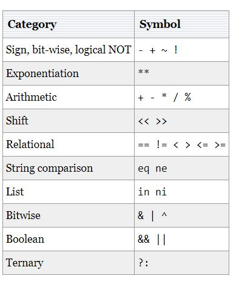

# TCL introduction & tutorials

Tool Command Language , a string based scripting language. commonly used for rapid prototyping, scripted applications, GUIs, and testing.

- start the interactive session with the `tclsh` command. The prompt changes to the `%` character

- Tcl **_comments_** start with the `#` character.

- **_White space_** is used to separate words in Tcl source

- In Tcl, **_0 is false_** and **_any nonzero value is true_**. **_yes_**, **_true_** mean true and **_0_**, **_no_**, false mean false.

---

## commands

A Tcl script consists of **_commands_**, separated by newlines or semicolons. followed by one or more words which are its arguments. Each argument is separated by white space. `command arg1 arg2 arg3`

`expr` command is used to perform arithmetic calculations

Variables in Tcl are created with the `set` command.

`puts`, `open`, `gets`, `flush`, `incr`, `info`, `set`, and `unset`

- `puts` command is used to **_print messages_** to the console or to other channels like a file.

- `puts ?-nonewline? ?channelId? string`

  Optional parameters are specified between question marks.

  - The `-nonewline` switch suppresses the newline character. By default, the command puts a newline to each message.
  - The channelId must be an identifier for an open channel , defaults to standard output channel stdout

- The `open` command opens a file, a serial port, or a command pipeline and returns a channel identifier

- The `gets` command reads a line from a channel, and the `flush` command flushes buffered output of a channel

- The `flush` command forces the output to appear immediately.

- The `incr` increments the value of a variable  
  `incr varName ?increment?`
  If a parameter is passed to the command, then its value is added to the value of the variable; otherwise the value is incremented by 1.

- The `info` command returns information about the state of the Tcl interpreter.
  examples  
  `puts [info tclversion]` print the version of the Tcl interpreter  
  `puts [info host]` prints the host name  
  `puts [info exists var]` check if the variable var is set

- The `set` command is used to create and read variables. The `unset` command destroys a variable.

- Command line arguments , Tcl has three predefined variables.

  - `$argc` - the number of arguments passed to the script
  - `$argv` - the list of arguments
  - `$argv0` - the name of the script

---

## Substitution

Square brackets are used for command substitution.

There are three kinds of substitutions in Tcl.

- Command substitution
- Variable substitution
- Backslash substitution

If a word contains a dollar sign `$`, then Tcl performs **_variable substitution_** (The dollar-sign and the following characters are replaced in the word by the value of a variable.)

the **_backslash substitution_**, we escape the original meaning of the character. For example, the `\n` stands for a **_new line_** and the `\t` is the **_tab character_** , `\b` is substituted with a **_backspace_**.

---

- **_Braces_** can be used instead of double quotes to set strings separated by a white space.
  substitution of words is disabled inside braces.(Everything is printed literally)

- also **_Braces_** are used to **_create lists_**

- **_Square brackets_**, [], are used to create nested commands.(nested commands are executed before the main command)

- **_Double quotes_** group words as a single argument to commands.( Commands , Dollar signs, square brackets, and the backslash are interpreted inside quotes)

- **_Round brackets_** are used to indicate an array subscript or to change the precedence of operators for the expr command.

---

## Backslash

The backslash character can be used in three different ways

- for special characters (escape sequences) (newlines, tabs, backspaces ......)
- escapes the meaning of special Tcl characters (`$, {}, "", \, ()`)
- a line continuation character.

---

## Expressions

In Tcl language the expressions are not built into the core language , it is evaluated with the `expr` command.

- operators used in the Tcl language



- There is also one **_ternary operator_** `?:`, which works with three operands. `cond-exp ? exp1 : exp2`

- and the **_Boolean operators_** (logical) ( && , || , ! )

- **_Relational operators_** comparison operators. ( < , <= , > , >= , == , != 0)

- **_Bitwise operators_**

- **_The expansion operator_** `{*}`, makes each item in a list an individual argument of the current command.

---

## Flow control

- if `if expr1 ?then? body1 elseif expr2 ?then? body2 elseif ... ?else? ?bodyN?` , The then command is optional.

- switch

- while

- for

```
for {set i 0} {$i < 10} {incr i} {
    puts $i
}
```

- foreach

```
foreach planet $planets {
    puts $planet
}
```

- break and continue

---

String commands

- `compare` ( `-nocase` , `-length 3` , `equal` )
- Pattern matching ( `regexp` )
- length `puts [string length $str]`
- index `puts [string index $str 0]`
- range `puts [string range $str 1 3]`
- split `puts [split $langs ,]`
- join `puts [join [split $langs ","] ":"]`
- `toupper`, `tolower`, `totitle`, `reverse`
- `format`( `%s` : conversion type for a string, `%f`: display decimal numbers ,`%d` : print an integer value , `%e` : show number in a scientific format)

---

## lists

- to create set `l1 { 1 2 3 }` or `set l2 [list one two three]`

- `llength` command counts the number of elements in a list.

- three basic commands for list element retrieval: lindex, lrange, and lassign.

  - `puts [lindex $vals 0]`

  - `puts [lrange { a b c d e } 2 4]` ===> `c d e`
  - `lassign { a b c } x y z ` , `puts "$x $y $z"` ===> `a b c`

- add elements to list

  - `linsert` , `puts [linsert $nums 0 1 2 3]` The first number is the index. The remaining values

  - `lappend` The lappend appends data to the list

- `lsearch` , `lreplace` , `lsort`

---

## arrays

- array is a collection of variables. Each variable may hold any value and the array is indexed by arbitrary values. The key-value pairs are unordered.
- arrays can be created with the `set` or `array set` commands.

```
set names(1) Jane
set names(2) Tom
set names(3) Elisabeth
....
```

```
array set days {
  1 Monday
  2 Tuesday
  3 Wednesday
  4 Thursday
  5 Friday
  6 Saturday
  7 Sunday
}
```

- array get command `puts [array get days]`
- array search

  - `startsearch` command references the beginning of the array.
  - `anymore` command returns 1 if there are any more elements left to be processed in an array search.
  - `nextelement` command returns the name of the next element in the array
  - `donesearch` command terminates an array search and destroys all the state associated with that search.

- the unset command remove an element from the array , `unset names(1)` remove the element with key 1 from the array.

---

## Procedures

- same as functions , The `proc` keyword is used to create new Tcl commands.

example :

```
proc maximum {x y} {

    if {$x > $y} {

        return $x
    } else {

        return $y
    }
}
```

- there is some buit-in procedures : `rand()`,`sin()` and `exp()`

- there is Implicit arguments if needed (used if no explicit value is provided) example `proc power {a {b 2}} {....}`

- The return command passes one value to the caller. There is often a need to return multiple values. In such cases, we can return a list.

---

## Input & output

Tcl uses objects called **_channels_** to read and write data.

The channels can be created using the open or socket command.

standard channels (They are automatically opened by the OS for each new application) :

- stdin (used by the scripts to read data)
- stdout (used by scripts to write data)
- stderr (used by scripts to write error messages)

`puts ?-nonewline? ?channelId? string`

The **_channelId_** is optional. If not specified, the default stdout is assumed.(where we want to write text)

- `read`

- The optional argument specifies the number of characters to read.

- `gets`

- reads the next line from the channel, returns everything in the line up to (but not including) the end-of-line character.

- `pwd` and `cd`

- glob : returns the names of the files that match a pattern

`set files [glob *.tcl]` : all files with the `.tcl` extension

- `file`

puts `[file volumes]`: returns the absolute paths to the volumes mounted on the system

`[file mkdir new]`: creates a directory called new.

also `copy` , `delete`

- The `eof` command checks for end-of-line of a supplied channel (read the contents of a file)

---

## EXERCISES

### 1

- Identity function
  returns its argument (any type of argument) unchanged

  ```
  proc i {x} {
  return $x ;
  }
  ```

- K combinator
  takes two arguments and always returns its first argument, unchanged

  ```
  proc K {a b} {
    return $a ;
  }
  ```

- iota function
  takes a numeric argument n and returns a list of numbers of length n which are the numbers from 0 to n-1

  ```
  proc iota {n} {
    set my_list {} ;
    set i 0
    while { $i < $n } {
      lappend my_list $i
      incr i 1
    }
    return $my_list ;
  }
  ```

- Incrlist function
  takes one argument, a list of numbers, and returns a list of equal length as a result, in which each element is the successor to the corresponding element of the argument list.

  ```
    proc incrlist {L} {
      set my_list {} ;

      foreach item $L {
        lappend my_list [ expr $item + 1]
      }

      return $my_list ;
    }
  ```

- Strlenlist function
  takes one argument, a list of strings, and returns a list of equal length as a result, in which each element is the string length of the corresponding element of the argument list

  ```
    proc strlenlist {L} {
      set my_list {} ;

      foreach item $L {
        lappend my_list [string length $item]
      }

      return $my_list ;
    }
  ```

- Sumlist function
  takes one argument, a list of numbers, and returns, as result, a single number: the sum of the numbers in the argument list.

  ```
    proc sumlist {L} {
      set sum 0;

      foreach item $L {
       set tem_sum [expr $sum + $item]
       set sum $tem_sum
      }
      return $sum ;
    }
  ```

- Multilist function
  takes one argument, a list of numbers, and returns, as result, a single number: the product of the numbers in the argument list

  ```
    proc multlist {L} {
      set result 1;

      foreach item $L {
       set tem_res [expr $result * $item]
       set result $tem_res
      }

      return $result ;
    }
  ```

- Catlist function
  takes one argument, a list of strings, and returns, as result, a single string: the concatenation of the strings in the argument list.

  ```
    proc catlist {L} {
      set result "";

      foreach item $L {
       append result $item
      }

      return $result ;
    }
  ```

- Factorial iteratively

  ```
    proc fact {num} {
      set result 1;
      set i 1
      while { $i <= $num } {
      set result [expr $i * $result ]
      incr i 1
    }

      return $result ;
    }
  ```

- Factorial using previous functions

  ```
    proc fact {num} {
      multlist [lrange [iota [expr $num + 1]] 1 end]  ;
    }
  ```

### 2

- Rewrite the iota function
  take an optional second argument which is an increment to separate the integer values. The default increment is 1

  ```
   proc iota {n {inc 1}} {
    set my_list {} ;
    set i 0
    while { $i < $n } {
      lappend my_list [expr $i * $inc ]
      incr i 1
    }
    return $my_list ;
  }
  ```

- Map function ???????

  ```
    proc map {f l} {
      set result {} ;
      foreach item $l {
       lappend result [$f $item]
      }
      return result ;
    }
  ```

- Foldl function

  - abstracts sumlist multlist and catlist foldl takes three arguments: `f` A binary function ,`id` The identity element for f , `L` A list
  - applies f pairwise to all the elements of L, left associatively.

  ```
  proc foldl {f id l} {
    foreach item $l { set id [invoke $f $id $item] }
    return $id
  }
  proc invoke {f args} { uplevel #0 $f $args }


  # proc + {a b} { expr {$a + $b} }
  # foldl + 0 {1 2 3 4 5} ;

  ```

- Zip function
  takes three arguments: `f` binary function ,`a` list , `b` another list
  applies f pairwise to corresponding elements of a and b, returning a list of the results.

  ```
   proc zip {f a b} {
     set result {};
     for {set i 0} {$i < [llength $a]} {incr i} {

       lappend result [invoke $f [lindex $a $i] [lindex $b $i]]

     }
     return $result ;
   }
   proc invoke {f args} { uplevel #0 $f $args }

    # proc + {a b} {expr $a + $b}
    # zip + [iota 10] [iota 10]

  ```

- Choose function
  takes three arguments: three equal-length lists ,the first two of arbitrary values, and the third a list of boolean values
  returns a list (also of the same length) where each element is chosen from one of the first two lists, depending on the corresponding boolean value. Elements of the first parameter are chosen for 1's (true), while elements of the second parameter are chosen for 0's (false).

  ```
   proc choose {trues falses bools} {
     set result {};
     for {set i 0} {$i < [llength $trues]} {incr i} {
       set temp  [lindex $falses $i] ;
       puts [lindex $falses $i]
       puts [lindex $trues $i]

       if [lindex $bools $i] {
         set temp  [lindex $trues $i] ;
       }
       puts $temp
       lappend result $temp ;
     }
     return $result ;
   }

    # choose [list a b c d] [list A B C D] [list 0 1 1 0]

  ```

- Vardefault function
  takes two arguments, the name of a variable, and a default value. If the variable is defined in the calling scope, vardefault returns the variable's value. If it is not defined, vardefault returns the default value.

  ```
    proc vardefault {var default} {
      <!-- upvar $var $x;
      if [info exists x]{
        set x $var
      } else {
      set x $default
      } -->

      ???????????????????????????
    }
  ```
