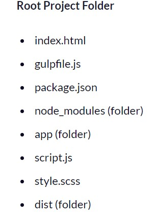

# Best Practise

## 23 front-end performance engineering rules for web apps

- long-term headers expiration dates (short-term expiration prevent effective caching)
- fewer HTTP requests
- reduce the number of URL redirect
- Avoid empty SRC or HREF
- Remove duplicate JavaScript and CSS
- Make AJAX cacheable
- Avoid HTTP 404 (Not Found) error (expensive and degrades the user experience)
- Use cookie-free domains (static components are requested with cookie-free requests by creating a subdomain and hosting them there)
- Reduce cookie size ( minimizes the impact on response time)
- Minify CSS and JavaScript ( removes unnecessary characters , it improving load times)
- Remove unnecessary CSS rules
- Reduce the number of DOM elements
- Reference images in the HTML
- Use CDN
- Reduce DNS lookups
- Use GET for AJAX requests (the browser implements POST in two steps: first it sends the headers, and then it sends the data. but - GETsends the headers and the data together in most cases)
- Javascript at the bottom
- Resize images

---

## Super simple Gulp tutorial for beginners

Gulp is a popular build tools

what it helps with

- Compiling Sass files to CSS
- Concatenating (combining) multiple JavaScript files
- Minifying (compressing) your CSS and JavaScript files
- And automatically running the above tasks when a file change is detected

getting started :

`npm install gulp`

then

```
npm install gulp-sass  (compiles your Sass files into CSS)
npm install gulp-cssnano (minifies your CSS files)
npm install gulp-concat (combines multiple JavaScript files into one large file)
npm install gulp-uglify (minifies your JavaScript files)
```

or we can instal the cli

`npm install --global gulp-cli`

---

what the project tree will look like



- `app folder`, we have your basic JavaScript file (script.js) and your basic SCSS file (style.scss).

- `dist folder` exists only to store the final compiled JavaScript and CSS files after Gulp has processed them

- `gulpfile.js` file is where we’ll configure Gulp

  ```
  var gulp = require('gulp');
  var cssnano = require('gulp-cssnano');
  var sass = require('gulp-sass');
  var concat = require('gulp-concat');
  var uglify = require('gulp-uglify');


  gulp.task('[Function Name]', function(){
  // Do stuff here
  }

  ```

  we run the Gulp task by typing in gulp [Function Name] into the command line

  These are the following tasks that we want Gulp to run:

  - Sass task

    ```
    gulp.task('sass', function(){
        return gulp.src('app/style.scss')
        .pipe(sass())
        .pipe(cssnano())
        .pipe(gulp.dest('dist/css'));
    });

    ```

  - JavaScript task

    ```
    gulp.task('js', function(){
        return gulp.src(['app/js/plugins/*.js', 'app/js/*.js'])
        .pipe(concat('all.js'))
        .pipe(uglify())
        .pipe(gulp.dest('dist'));
     });

    ```

  - Watch task (to detect when SCSS or JavaScript files are changed, and re-run the tasks)

    ```
    gulp.task('watch', function(){
      gulp.watch('app/*.scss', ['sass']);
      gulp.watch('app/js/**/*.js', ['js']);
    });

    ```

  - Default task (to run all needed tasks when you type gulp into the command line)

---

# SVN

a centralized version control system (the version history is stored in a central server.), an Apache Subversion (SVN) client

- some new Terms

  - Trunk a directory where all the main development happens
  - Tags The tags directory is used to store named snapshots of the project

- basic things

  - User Setup `htpasswd -cm /etc/svn-users < name >`
  - Create Subversion parent directory `mkdir /var/www/svn`
  - Repository `Setup svnadmin create <project_repo>`
  - sestatus `sestatus` and read the deatails
  - To provide repository access to only authentic users and to use the default authorization file; append the following lines to project_repo/conf/svnserve.conf file.

  ```
  anon-access = none
  authz-db = authz
  ```

  - import the directories from /tmp/svn-template to the repository
    `-m 'Create trunk, branches, tags directory structure' /tmp/svn-template/ `

- **_Checkout_** operation is used to create a working copy from the repository. (Working copy is a private workplace where developers do their changes, and later on, submit these changes to the repository.)
- **_update_** operation is used to update working copy.(synchronizes the working copy with the repository).
- Perform Changes , (`Edit`, `add/remove` ,`Delete` , `Rename` ,`Move`) files/directories do not become a part of the repository, instead they are added to the pending change-list and become a part of the repository after the commit operation.
- **_Revert_** operation reverts the modifications that have been made to the working copy.
- The **_resolve_** operation is used to help the user figure out things and to inform VCS about the ways of handling the conflicts.
- **_Commit_** operation is used to apply changes from the working copy to the repository.

---

created the file

```
svn status
?       array.c
```

'?' in front of filenames because it doesn't know what to do with these files

`svn add array.c `

```
svn status
?       array.c
A         array2.c
```

A before array.c, it means, the file is successfully added to the pending change-list.

`svn commit -m "Initial commit"`

Now array.c file is successfully added to the repository

edited the code

```
svn status
M       array.c
```

M letter before file name array.c file is modified

- `svn diff` will show the diffrensec

- `svn revert array.c`

- To revert a directory, use -R `svn revert -R trunk`

- add a file `cat README`


- update  working copy `svn up`

- bransh `svn copy trunk branches/jerry_branch`

