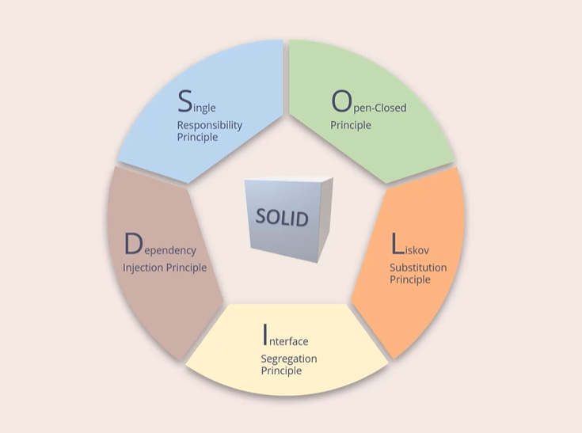

 

- Single Responsibility principle  
    every software component should have one and only one responsibility (reson to change)

    - Cohesion and Coupling 
    - Reasons for Change : Each responsibility or reason for change introduces complexity and potential fragility into code, so separating responsibilities helps mitigate these issues.

- 
